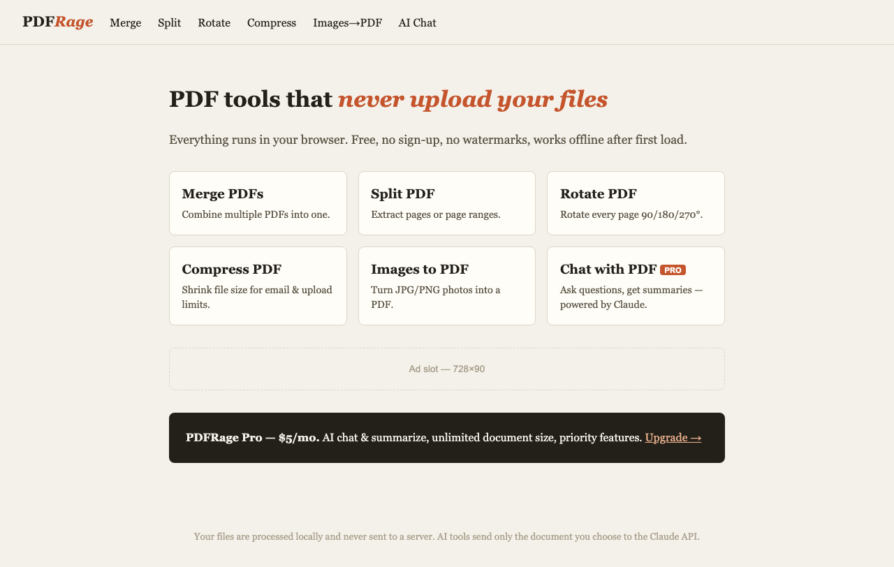

# PDFRage

**PDF tools that never upload your files.** Merge, split, rotate, compress, delete pages,
add page numbers, convert images, and chat with PDFs — everything runs in your browser.
No server, no accounts, no tracking, no file ever leaves your device.



## Why another PDF tool?

Every "free online PDF tool" uploads your document to someone else's server. For a
resume that's annoying; for a contract, medical record, or financial statement it's a
compliance problem. PDFRage is a static site: the PDF processing happens in your
browser via [pdf-lib](https://pdf-lib.js.org/) and [pdf.js](https://mozilla.github.io/pdf.js/).
There is no backend to trust — you can read every line of code in this repo, or
self-host it and cut the internet entirely (tools keep working offline after first load).

The one exception is **Chat with PDF**, which sends the document you choose directly
from your browser to the Claude API using your own API key. Nothing routes through us —
there is no "us" to route through.

## Tools

Merge · Split (extract ranges) · Delete pages · Rotate · Compress · Images → PDF ·
Page numbers · Chat with PDF (AI Q&A / summaries, BYO Claude key)

## Self-host

It's a static site — any web server works:

```sh
# Docker
docker build -t pdfrage . && docker run -p 8080:80 pdfrage

# or literally anything that serves files
python3 -m http.server 8080
```

Open http://localhost:8080.

## Development

No build step. Edit the HTML/JS, refresh the browser. Libraries load from CDN via
import maps; the same `pdf-tools.mjs` module is unit-tested in Node:

```sh
npm install
npm test               # logic self-check
node browser-check.mjs # end-to-end check in headless Chromium (server must be running)
```

Adding a tool = one new HTML page + (usually) one function in `pdf-tools.mjs`.
Copy `rotate.html` as a template.

## License

[MIT](LICENSE)
